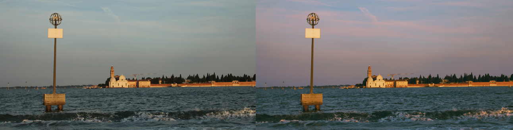

# LUT Generation

Generate custom 3D LUTs (Look-Up Tables) for color grading using AI-guided optimization. Transform your images to match any text prompt (e.g., "golden hour", "cinematic teal and orange", "vintage film").

Note: a lot of vibe-coding was used to write this code.



## Features

- 🎨 **Text-to-LUT**: Generate LUTs from natural language prompts using CLIP, Gemma 3, or DeepFloyd IF
- 🤖 **Multiple Models**: Choose from CLIP, Gemma 3 (4B, 12B, 27B), or SDS for different quality/speed tradeoffs
- 🔍 **Context-Aware VLM**: Gemma 3 models evaluate transformations by comparing before/after images
- 🔧 **Export format**: Exports standard .cube files compatible with most photo/video software
- ⚡ **GPU & CPU support**: Works with CUDA, MPS (Apple Silicon), or CPU

## Installation

### Prerequisites

- Python 3.11+
- [uv](https://github.com/astral-sh/uv) package manager
- A small dataset of 25-100 images, alternatively you can download [some images from me](https://drive.google.com/file/d/1bN03SkGs6E_K1C9Dc9r1Hl0BK48LqMQ2/view?usp=drive_link)

### Setup

```bash
# Clone the repository
git clone https://github.com/jonathangranskog/lut_generation.git
cd lut_generation

# Install dependencies
uv sync
```

## Quick Start

### 1. Optimize a LUT

```bash
python main.py optimize \
  --prompt "golden hour warm sunlight" \
  --image-folder images/ \
  --steps 500
```

This will:
- Load images from `images/`
- Optimize a LUT to make images match the prompt
- Save training progress to `tmp/training_logs/golden_hour_warm_sunlight/`
- Save the final LUT to `lut.cube`

### 2. Apply a LUT to Images

```bash
python main.py infer \
  lut.cube \
  input_image.jpg \
  --output-path result.jpg
```

### 3. Run tests

```bash
pytest -v
```

It will skip the VLM tests if you are not logged in to huggingface or if CUDA is unavailable. 

### 4. LUT library generation

```bash
python scripts/generate_luts.py --sample 100 --test-image images/IMG_0001.png --image-folder images --output-dir tmp/generated_luts/
```

This command generates 100 LUTs automatically using CLIP

## Commands

### `optimize` - Generate a LUT

```bash
python main.py optimize [OPTIONS]
```

**Required Options:**
- `--prompt TEXT`: Text description of desired look (e.g., "warm sunset", "cinematic look")
- `--image-folder PATH`: Folder containing training images

**Key Options:**
- `--model-type`: Model to use (default: "clip")
  - `clip`: CLIP ViT-B/32 (RECOMMENDED: fast, great quality, evaluates final image only)
  - `gemma3_4b`: Gemma 3 4B (fastest VLM, context-aware transformations)
  - `gemma3_12b`: Gemma 3 12B (balanced, recommended for VLM)
  - `gemma3_27b`: Gemma 3 27B (highest quality, slowest)
  - `sds`: Score Distillation Sampling with DeepFloyd IF (pixel-space diffusion model)
  - Note: Gemma models compare original vs transformed images. They work best for precise minute LUTs.
- `--steps INT`: Training iterations (default: 500)
- `--learning-rate FLOAT`: Learning rate (default: 0.005)
- `--grayscale`: Optimize a black-and-white LUT (single channel) that outputs same intensity for RGB (default: False)
- `--image-text-weight FLOAT`: Weight of the text prompt loss
- `--image-smoothness FLOAT`: Image-space anti-banding strength (default: 1.0)
- `--image-regularization FLOAT`: Keep changes subtle (default: 1.0)
- `--black-preservation FLOAT`: Retain black values to reduce fading (default: 1.0)
- `--repr-smoothness FLOAT`: Representation-space anti-banding strength (default: 1.0)
- `--batch-size INT`: Batch size (default: 4)
- `--log-interval INT`: Save progress every N steps (default: 50, 0 to disable)
- `--output-path PATH`: Output .cube file (default: "lut.cube")
- `--test-image PATH`: Image to apply LUT to during logging (repeat flag for multiple images, default picks a random training image)
- `--verbose`: Show detailed loss breakdown every 10 steps

**Examples:**

Standard color LUT with CLIP:
```bash
python main.py optimize \
  --prompt "cinematic teal and orange" \
  --image-folder images/ \
  --model-type clip \
  --output-path cinematic.cube \
  --test-image photo1.jpg \
  --test-image photo2.jpg \
  --verbose
```

VLM with context-aware transformations:
```bash
python main.py optimize \
  --prompt "warm golden hour" \
  --image-folder images/ \
  --model-type gemma3_12b \
  --batch-size 1 \
  --output-path golden_hour.cube
```

SDS with DeepFloyd IF:
```bash
python main.py optimize \
  --prompt "kodak portra 400 film" \
  --image-folder images/ \
  --model-type sds \
  --output-path portra.cube \
  --image-text-weight 10.0 \
  --batch-size 1
```

Black-and-white LUT with grayscale optimization:
```bash
python main.py optimize \
  --prompt "black and white noir film" \
  --image-folder images/ \
  --grayscale \
  --steps 500 \
  --output-path noir_bw.cube
```

### `infer` - Apply a LUT

```bash
python main.py infer CKPT_PATH IMAGE_FILE [OPTIONS]
```

**Arguments:**
- `CKPT_PATH`: Path to .cube file
- `IMAGE_FILE`: Path to input image

**Options:**
- `--output-path PATH`: Output image path (default: "output.png")

**Example:**
```bash
python main.py infer \
  golden_hour.cube \
  photo.jpg \
  --output-path photo_graded.jpg
```

## Understanding the Parameters

### Loss Components

During optimization, the total loss consists of:

1. **Image-text Loss** (dependent on model): Semantic similarity to text prompt
2. **Image Smoothness** (0.0-0.01): Prevents banding and posterization
3. **Image Regularization** (0.0-0.1): Keeps output close to input (subtle changes)
4. **Black Preservation** (~0.0-0.0001): Retains black levels
5. **Repr Smoothness** (~0.0-0.01): Prevents banding in representation-space

Watch the verbose output to see how each contributes:
```
Step 100: Loss = 0.7935 (CLIP: 0.7905, Smooth: 0.0004, Reg: 0.0017, Black: 0.0000, Repr Smooth: 0.0008)
```

# Limitations

### Accuracy

Large transformations, like black-and-white filters, are harder to learn. Some prompts might lead to incorrect results based on the model's understanding of language (e.g. "not red" might lead to "red" LUTs).

### Artifacts

Higher resolution or long training of LUTs might lead to banding artifacts. To combat, increase weights of regularization losses, lower learning rate or reduce LUT resolution.

# Future Improvements

* Better regularization so more complex LUTs can be generated
* Other representations besides LUTs

# License

The code is licensed under the MIT License.

Note that [Gemma](https://ai.google.dev/gemma/terms) and [DeepFloydIF](https://huggingface.co/spaces/DeepFloyd/deepfloyd-if-license) have their own licenses that you must follow if you use them.